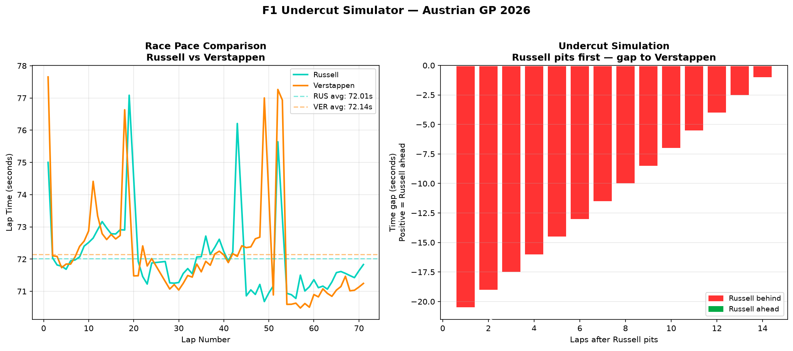

# F1 Undercut/Overcut Simulator

A Python tool that models whether an undercut strategy would have worked between two drivers at a specific Formula 1 Grand Prix, using real race pace data from the FastF1 API.

## What it does

This simulator takes real lap time data for two drivers and models the undercut scenario — calculating how many laps it would take for fresh tyre pace advantage to overcome pit lane time loss. It produces two charts:

- Race pace comparison between the two drivers across the full race
- Lap-by-lap undercut gap simulation showing when (or if) the undercut breaks even

## Example Output

This example simulates whether Russell could have undercut Verstappen at the 2026 Austrian GP. The result shows the undercut would not work within 14 laps — correctly reflecting that Russell already had faster pace and track position, making an undercut unnecessary.

## Key Parameters

- **Pit loss:** 22 seconds (typical Red Bull Ring pit lane delta)
- **Fresh tyre advantage:** 1.5 seconds per lap
- **Simulation window:** 14 laps post pit stop

## Tech Stack

- Python
- [FastF1](https://github.com/theOehrly/Fast-F1) — official F1 timing and telemetry data
- Matplotlib — data visualisation
- NumPy — numerical calculations
- Pandas — data handling

## How to Run

1. Install dependencies: `pip install fastf1 matplotlib pandas numpy`
2. Run the script: `python undercut_simulator.py`
3. Charts will display and save as `undercut_simulator.png`

## Why This Project

The undercut is one of the most decisive strategic tools in Formula 1. This project builds the analytical foundation for understanding when and why undercuts succeed or fail — core knowledge for any aspiring race strategist.

## Author

Hamna Shahzad — BS Electrical Engineering Student
